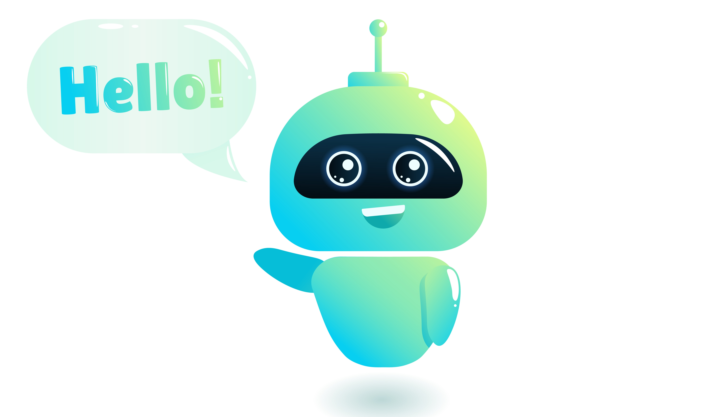

</img>

<h1 align="center">I'm Aditya</h1>
<h3 align="center">A passionate Computer science (basically Machine learning) student from 🇮🇳 India, with a dream of being Alan Turing of 21st century 😄 </h3>

  

- 🌱 I’m currently learning **Golang and Dart**

- 👨‍💻 All of my projects are available at [https://github.com/MrAdityaAlok/](https://github.com/MrAdityaAlok/)

- 💬 Ask me about **Machine Learning, C/C++, Go, React, Django, Android, Java, Python and web development**

- 📫 How to reach me **mradityaalok21@gmail.com**
<h1>📊 My GitHub stats </h1>

&nbsp;

